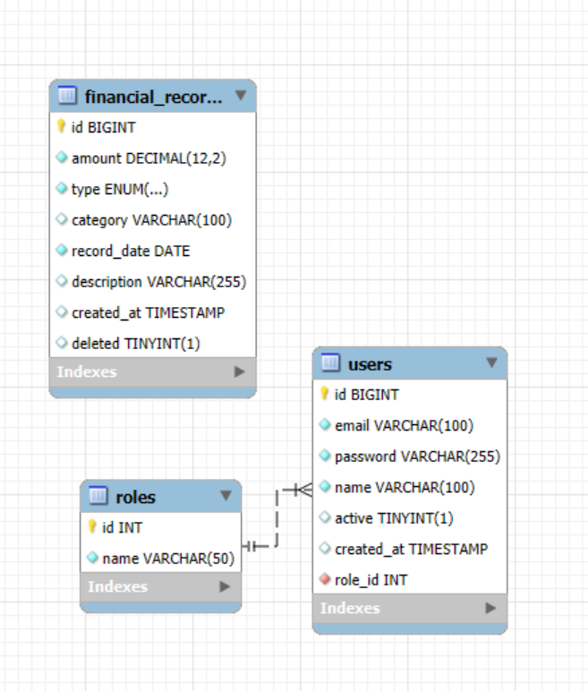

# 💰 Financial Dashboard — Backend API

A production-grade **RESTful API** for managing financial records, built with **Spring Boot 4** and **Java 21**. The system provides secure authentication, role-based access control with hierarchical permissions, comprehensive CRUD operations on financial records, and a powerful analytics dashboard with trend tracking.

---

## 📑 Table of Contents

- [Features](#-features)
- [Tech Stack](#-tech-stack)
- [Architecture](#-architecture)
- [Getting Started](#-getting-started)
  - [Prerequisites](#prerequisites)
  - [Database Setup](#database-setup)
  - [Run the Application](#run-the-application)
- [Authentication](#-authentication)
- [Role-Based Access Control](#-role-based-access-control)
- [API Reference](#-api-reference)
  - [Auth Endpoints](#auth-endpoints)
  - [Admin Endpoints](#admin-endpoints)
  - [Financial Record Endpoints](#financial-record-endpoints)
  - [Dashboard Endpoints](#dashboard-endpoints)
- [Data Model](#-data-model)
- [Categories](#-categories)
- [Error Handling](#-error-handling)
- [Project Structure](#-project-structure)

---

## ✨ Features

| Area | Highlights |
|---|---|
| **Authentication** | JWT-based stateless authentication with configurable token expiration |
| **Authorization** | Hierarchical role-based access control (ADMIN > ANALYST > VIEWER) |
| **Financial Records** | Full CRUD with soft-delete, category-type validation, and rich filtering |
| **Dashboard Analytics** | Total income/expenses, net balance, category-wise breakdowns, trends |
| **Trend Analysis** | Weekly and monthly income vs. expense trends with gap-filling for zero-activity periods |
| **User Management** | Admin-only user creation, updates (including role & password changes), and deletion |
| **Advanced Filtering** | JPA Specification-based dynamic filtering with pagination & sorting on records and users |
| **Validation** | Comprehensive Bean Validation on all request DTOs with custom cross-field constraints |
| **Error Handling** | Centralized `@RestControllerAdvice` global exception handler with consistent JSON error responses |
| **Soft Delete** | Financial records use Hibernate `@SQLDelete` / `@SQLRestriction` for non-destructive deletion |

---

## 🛠 Tech Stack

| Layer | Technology |
|---|---|
| **Language** | Java 21 |
| **Framework** | Spring Boot  |
| **Security** | Spring Security + JWT |
| **ORM** | Spring Data JPA / Hibernate |
| **Database** | MySQL |
| **Mapping** | MapStruct + Lombok |
---

## 🏗 Architecture

The project follows a **layered architecture** with clean separation of concerns:

```
┌──────────────────────────────────────────────────┐
│                   Controllers                     │
│   Auth · Admin · FinancialRecord · Dashboard     │
├──────────────────────────────────────────────────┤
│                    Services                       │
│  AuthService · UserService · FinancialRecord     │
│  Service · DashboardService · Authorization      │
├──────────────────────────────────────────────────┤
│               Repositories (JPA)                  │
│  UserRepo · RoleRepo · FinancialRecordRepo       │
├──────────────────────────────────────────────────┤
│              MySQL Database                       │
└──────────────────────────────────────────────────┘
```

**Cross-cutting concerns:**
- **Security Layer** — `AuthTokenFilter` → `JWTService` → `CustomUserDetailsService`
- **Exception Handling** — `GlobalExceptionHandler` (centralized `@RestControllerAdvice`)
- **DTO Mapping** — MapStruct mappers (`UserMapper`, `FinancialRecordMapper`)
- **Dynamic Queries** — JPA Specifications (`UserSpecification`, `FinancialRecordSpecification`)

---

## 🚀 Getting Started

### Prerequisites

- **Java 21** or higher
- **MySQL 8.0+**
- **Maven 3.9+** (or use the included Maven Wrapper)

## Database Structure and Setup
### Entities 
- User
- Role
- FinancialRecord


### Relationships:
-  User -> Role (Many-to-One)
 - FinancialRecord (Independent entity)
### ER DIAGRAM 


### Run the Application

Using the Maven Wrapper (no Maven installation required):

```bash
# Linux / macOS
./mvnw spring-boot:run

# Windows
mvnw.cmd spring-boot:run
```

Or build and run the JAR:

```bash
./mvnw clean package -DskipTests
java -jar target/zorvyn_technical_assignment-0.0.1-SNAPSHOT.jar
```

The server starts on **`http://localhost:8080`** by default.

---

## 🔐 Authentication

The API uses **JWT (JSON Web Token)** based stateless authentication.

### Login Flow

1. Send a `POST` request to `/api/auth/login` with email and password.
2. Receive a JWT access token in the response.
3. Include the token in the `Authorization` header for all subsequent requests:

```
Authorization: Bearer <your_jwt_token>
```

### Token Details

| Property | Value |
|---|---|
| **Algorithm** | HMAC-SHA256 |
| **Expiration** | Configurable via `security.jwt.expiration-time` (default: 360,000 ms = 6 min) |
| **Claims** | `sub` (user ID), `email`, `role` |

---

## 🛡 Role-Based Access Control

The system implements a **hierarchical** RBAC model with three roles:

```
ADMIN  ──▶  ANALYST  ──▶  VIEWER
 (all)       (read +       (read
              records)      only)
```

| Role | Capabilities |
|---|---|
| **ADMIN** | Full access — manage users, create/update/delete financial records, view dashboard & analytics |
| **ANALYST** | Read financial records (with filtering, pagination, sorting), view dashboard & analytics |
| **VIEWER** | View dashboard summaries, trends, category breakdowns, and recent activity |

> **Hierarchy:** Each higher role inherits all permissions of the roles below it. An `ADMIN` can do everything an `ANALYST` and `VIEWER` can do.

---

## 📖 API Reference

### Auth Endpoints

| Method | Endpoint | Access | Description |
|---|---|---|---|
| `POST` | `/api/auth/login` | Public | Authenticate user and receive JWT token |

<details>
<summary><b>POST /api/auth/login</b> — Request / Response</summary>

**Request Body:**
```json
{
  "email": "admin@example.com",
  "password": "password123"
}
```

**Response (200 OK):**
```json
{
  "accessToken": "eyJhbGciOiJIUzI1NiJ9...",
  "user": {
    "id": 1,
    "name": "Admin User",
    "email": "admin@example.com",
    "role": "ADMIN",
    "active": true,
    "createdAt": "2025-01-15T10:30:00"
  }
}
```
</details>

---

### Admin Endpoints

> 🔒 All endpoints require **ADMIN** role.

#### User Management

| Method | Endpoint | Description |
|---|---|---|
| `POST` | `/api/admin/users` | Create a new user |
| `GET` | `/api/admin/users` | List users with filtering, pagination & sorting |
| `GET` | `/api/admin/users/{userId}` | Get a specific user by ID |
| `PUT` | `/api/admin/users/{userId}` | Update user details (name, email, password, role, active status) |
| `DELETE` | `/api/admin/users/{userId}` | Delete a user |

<details>
<summary><b>POST /api/admin/users</b> — Create User</summary>

**Request Body:**
```json
{
  "name": "Jane Doe",
  "email": "jane@example.com",
  "password": "securePass123",
  "role": "ANALYST"
}
```

**Validation Rules:**
- `name` — Required, non-blank
- `email` — Required, must be a valid email format, must be unique
- `password` — Minimum 8 characters
- `role` — Optional (defaults to `VIEWER`). Accepted values: `ADMIN`, `ANALYST`, `VIEWER`

**Response (201 Created):**
```json
{
  "response": "User Created Successfully",
  "user": {
    "id": 5,
    "name": "Jane Doe",
    "email": "jane@example.com",
    "role": "ANALYST",
    "active": true,
    "createdAt": "2025-03-20T14:22:00"
  }
}
```
</details>

<details>
<summary><b>GET /api/admin/users</b> — List Users (Filtered + Paginated)</summary>

**Query Parameters:**

| Parameter | Type | Default | Description |
|---|---|---|---|
| `name` | String | — | Filter by name (partial match) |
| `email` | String | — | Filter by email (partial match) |
| `role` | String | — | Filter by role (`ADMIN`, `ANALYST`, `VIEWER`) |
| `active` | Boolean | — | Filter by active status |
| `page` | Integer | `0` | Page number (zero-indexed) |
| `size` | Integer | `10` | Page size |
| `sortBy` | String | `id` | Sort field |
| `ascending` | Boolean | `true` | Sort direction |

**Example:** `GET /api/admin/users?role=ANALYST&active=true&page=0&size=5&sortBy=name&ascending=true`
</details>

<details>
<summary><b>PUT /api/admin/users/{userId}</b> — Update User</summary>

**Request Body (all fields optional):**
```json
{
  "name": "Jane Smith",
  "email": "janesmith@example.com",
  "password": "newSecurePass456",
  "role": "ADMIN",
  "active": false
}
```
</details>

#### Financial Record Management (Admin)

| Method | Endpoint | Description |
|---|---|---|
| `POST` | `/api/admin/records` | Create a new financial record |
| `PUT` | `/api/admin/records/{recordId}` | Update an existing record |
| `DELETE` | `/api/admin/records/{recordId}` | Soft-delete a record |

<details>
<summary><b>POST /api/admin/records</b> — Create Financial Record</summary>

**Request Body:**
```json
{
  "amount": 15000.50,
  "type": "INCOME",
  "category": "PRODUCT_SALES",
  "recordDate": "2025-03-15",
  "description": "Q1 product sales revenue"
}
```

**Validation Rules:**
- `amount` — Required, ≥ 0, max 10 integer digits + 2 decimal places
- `type` — Required (`INCOME` or `EXPENSE`)
- `category` — Required, must belong to the selected `type` (cross-field validation)
- `recordDate` — Required, must be in the past or present (`yyyy-MM-dd`)
- `description` — Optional

**Response (201 Created):**
```json
{
  "id": 42,
  "amount": 15000.50,
  "type": "INCOME",
  "category": "PRODUCT_SALES",
  "recordDate": "2025-03-15",
  "description": "Q1 product sales revenue",
  "createdAt": "2025-03-20T14:30:00"
}
```
</details>

---

### Financial Record Endpoints

> 🔒 Requires **ANALYST** role or higher.

| Method | Endpoint | Description |
|---|---|---|
| `GET` | `/api/records/{recordId}` | Get a specific financial record by ID |
| `GET` | `/api/records` | List records with dynamic filtering, pagination & sorting |

<details>
<summary><b>GET /api/records</b> — Filtered Records (Paginated)</summary>

**Query Parameters:**

| Parameter | Type | Default | Description |
|---|---|---|---|
| `startDate` | LocalDate | — | Filter records on or after this date (`yyyy-MM-dd`) |
| `endDate` | LocalDate | — | Filter records on or before this date |
| `category` | String | — | Filter by category (e.g., `SALARIES`, `PRODUCT_SALES`) |
| `type` | String | — | Filter by type (`INCOME` or `EXPENSE`) |
| `minAmount` | BigDecimal | — | Minimum amount filter |
| `maxAmount` | BigDecimal | — | Maximum amount filter |
| `page` | Integer | `0` | Page number (zero-indexed) |
| `size` | Integer | `10` | Page size |
| `sortBy` | String | `id` | Sort field (e.g., `amount`, `recordDate`, `category`) |
| `ascending` | Boolean | `true` | Sort direction |

**Example:**
```
GET /api/records?type=EXPENSE&startDate=2025-01-01&endDate=2025-03-31&minAmount=1000&sortBy=amount&ascending=false&page=0&size=20
```
</details>

---

### Dashboard Endpoints

> 🔒 Requires **VIEWER** role or higher.

| Method | Endpoint | Description |
|---|---|---|
| `GET` | `/api/dashboard/total-income` | Get total income across all records |
| `GET` | `/api/dashboard/total-expense` | Get total expenses across all records |
| `GET` | `/api/dashboard/net-balance` | Get net balance (income − expenses) |
| `GET` | `/api/dashboard/category-wise` | Get totals broken down by every category |
| `GET` | `/api/dashboard/recent-activity` | Get the N most recent financial records |
| `GET` | `/api/dashboard/trends` | Get weekly or monthly income vs. expense trends |

<details>
<summary><b>GET /api/dashboard/total-income</b> — Response</summary>

```json
{
  "summaryType": "TOTAL_INCOME",
  "value": 285000.00
}
```
</details>

<details>
<summary><b>GET /api/dashboard/category-wise</b> — Response</summary>

Returns totals for **every** category (even those with zero activity):
```json
[
  { "category": "PRODUCT_SALES", "type": "INCOME", "totalAmount": 120000.00 },
  { "category": "SERVICE_REVENUE", "type": "INCOME", "totalAmount": 85000.00 },
  { "category": "SALARIES", "type": "EXPENSE", "totalAmount": 95000.00 },
  { "category": "MARKETING", "type": "EXPENSE", "totalAmount": 0.00 },
  ...
]
```
</details>

<details>
<summary><b>GET /api/dashboard/recent-activity</b> — Query Parameters</summary>

| Parameter | Type | Default | Description |
|---|---|---|---|
| `n` | Long | `10` | Number of recent records to return (min: 1) |

**Example:** `GET /api/dashboard/recent-activity?n=5`
</details>

<details>
<summary><b>GET /api/dashboard/trends</b> — Query Parameters</summary>

| Parameter | Type | Default | Description |
|---|---|---|---|
| `type` | String | `MONTHLY` | Trend period — `WEEKLY` or `MONTHLY` |
| `n` | Integer | 12 (monthly) / 4 (weekly) | Number of periods to return (min: 1) |

**Example:** `GET /api/dashboard/trends?type=WEEKLY&n=8`

**Response:**
```json
[
  { "period": "2025-W5",  "totalIncome": 12000.00, "totalExpense": 8500.00 },
  { "period": "2025-W6",  "totalIncome": 0.00,     "totalExpense": 0.00 },
  { "period": "2025-W7",  "totalIncome": 18000.00, "totalExpense": 12000.00 },
  ...
]
```

> **Note:** Periods with no activity are automatically filled in with zero values so the response always contains a contiguous sequence.
</details>

---

## 📊 Data Model

### Entity Relationship Diagram

```
┌─────────────────┐       ┌─────────────────┐
│      roles      │       │      users      │
├─────────────────┤       ├─────────────────┤
│ id (PK)         │◄──────│ role_id (FK)    │
│ name (ENUM)     │       │ id (PK)         │
│                 │       │ name            │
│  ADMIN          │       │ email (UNIQUE)  │
│  ANALYST        │       │ password        │
│  VIEWER         │       │ active          │
└─────────────────┘       │ created_at      │
                          └─────────────────┘

┌──────────────────────────┐
│    financial_records     │
├──────────────────────────┤
│ id (PK)                  │
│ amount (DECIMAL)         │
│ type (ENUM)              │
│ category (ENUM)          │
│ description (TEXT)       │
│ record_date (DATE)       │
│ created_at (DATETIME)    │
│ deleted (BOOLEAN)        │  ← soft delete
└──────────────────────────┘
```

---

## 📂 Categories

Categories are tied to a specific record type and are validated at both the DTO and service level.

### Income Categories
| Category | Description |
|---|---|
| `PRODUCT_SALES` | Revenue from product sales |
| `SERVICE_REVENUE` | Revenue from services rendered |
| `SUBSCRIPTION_REVENUE` | Recurring subscription income |
| `CONSULTING_REVENUE` | Consulting engagement income |
| `LICENSING_REVENUE` | Revenue from licensing agreements |
| `INVESTMENT_INCOME` | Returns from investments |
| `INTEREST_INCOME` | Interest earned |
| `OTHER_INCOME` | Miscellaneous income |

### Expense Categories
| Category | Description |
|---|---|
| `SALARIES` | Employee compensation |
| `OFFICE_RENT` | Office space rental costs |
| `UTILITIES` | Utility bills (electricity, water, etc.) |
| `SOFTWARE_SUBSCRIPTIONS` | Software & SaaS subscriptions |
| `MARKETING` | Marketing campaigns & activities |
| `ADVERTISING` | Advertising spend |
| `TRAVEL_EXPENSE` | Business travel costs |
| `EQUIPMENT` | Equipment purchases |
| `MAINTENANCE` | Maintenance & repair costs |
| `TAX` | Tax payments |
| `INSURANCE` | Insurance premiums |
| `LEGAL_FEES` | Legal services & fees |
| `CONSULTING_FEES` | External consulting expenses |
| `TRAINING` | Employee training & development |
| `OFFICE_SUPPLIES` | Office supplies & materials |
| `OTHER_EXPENSE` | Miscellaneous expenses |

---

## ⚠️ Error Handling

All errors return a consistent JSON structure:

```json
{
  "status": 404,
  "message": "Record Not Found for ID : 99",
  "path": "/api/records/99",
  "timestamp": "2025-03-20T14:35:00"
}
```

### HTTP Status Codes

| Status | When |
|---|---|
| `400 Bad Request` | Validation failures, type mismatches, malformed JSON, missing parameters |
| `401 Unauthorized` | Missing/expired/invalid JWT token, bad credentials |
| `403 Forbidden` | Insufficient role permissions, disabled account |
| `404 Not Found` | User or record not found, unknown API endpoint |
| `405 Method Not Allowed` | Unsupported HTTP method on endpoint |
| `409 Conflict` | Duplicate email on user registration |
| `500 Internal Server Error` | Unhandled server errors |

---

## 📁 Project Structure

```
src/main/java/namankhurana/zorvyn_technical_assignment/
│
├── ZorvynTechnicalAssignmentApplication.java   # Application entry point
│
├── config/
│   └── JacksonConfig.java                      # Jackson ObjectMapper configuration
│
├── controller/
│   ├── AuthController.java                     # Login endpoint
│   ├── AdminController.java                    # User & record management (ADMIN)
│   ├── FinancialRecordController.java          # Record read operations (ANALYST+)
│   ├── DashboardController.java                # Analytics & summaries (VIEWER+)
│   └── UserController.java                     # User-facing endpoints (VIEWER+)
│
├── dto/
│   ├── LoginDTO.java                           # Login request
│   ├── LoginResponse.java                      # Login response (token + user)
│   ├── RegisterUserDTO.java                    # User creation request
│   ├── UpdateUserDTO.java                      # User update request
│   ├── CreateFinancialRecordDTO.java           # Record creation request
│   ├── FinancialRecordRequestDTO.java          # Record update request
│   ├── FinancialRecordFilterDTO.java           # Record filter parameters
│   ├── UserFilterDTO.java                      # User filter parameters
│   ├── DashboardSummaryDTO.java                # Summary response (income/expense/balance)
│   ├── CategoryWiseRecordDTO.java              # Category breakdown response
│   ├── TrendsDTO.java                          # Trend data response
│   ├── CreateUserResponseDTO.java              # User creation response wrapper
│   └── entity/
│       ├── UserDTO.java                        # User response DTO
│       └── FinancialRecordDTO.java             # Record response DTO
│
├── entity/
│   ├── User.java                               # User JPA entity
│   ├── Role.java                               # Role JPA entity
│   └── FinancialRecord.java                    # Financial record entity (soft delete)
│
├── enums/
│   ├── RolesEnum.java                          # ADMIN, ANALYST, VIEWER
│   ├── RecordTypeEnum.java                     # INCOME, EXPENSE
│   ├── CategoryEnum.java                       # 24 categories mapped to record types
│   ├── DashboardSummaryTypeEnum.java           # Summary type identifiers
│   └── TrendTypeEnum.java                      # WEEKLY, MONTHLY
│
├── exception/
│   ├── GlobalExceptionHandler.java             # Centralized exception handling
│   ├── ErrorResponse.java                      # Standard error response structure
│   ├── ExceptionUtil.java                      # Error response builder utility
│   ├── BadRequestException.java
│   ├── EmailAlreadyExistsException.java
│   ├── ForbiddenResourceException.java
│   ├── ResourceNotFoundException.java
│   └── UserNotFoundException.java
│
├── mapper/
│   ├── UserMapper.java                         # MapStruct: User ↔ UserDTO
│   └── FinancialRecordMapper.java              # MapStruct: Record ↔ RecordDTO
│
├── repository/
│   ├── UserRepository.java                     # User data access
│   ├── RoleRepository.java                     # Role data access
│   └── FinancialRecordRepository.java          # Record data access + custom JPQL queries
│
├── security/
│   ├── SecurityConfig.java                     # Security filter chain, CORS, role hierarchy
│   ├── AuthTokenFilter.java                    # JWT extraction & validation filter
│   ├── JWTService.java                         # Token generation, parsing, validation
│   ├── CustomUserDetailsService.java           # UserDetailsService implementation
│   ├── UserPrincipal.java                      # Custom UserDetails implementation
│   ├── CustomAuthenticationProvider.java        # Custom authentication logic
│   ├── CustomAccessDeniedHandler.java          # 403 response handler
│   └── JWTAuthenticationEntryPoint.java        # 401 response handler
│
├── service/
│   ├── AuthService.java / AuthServiceImpl.java
│   ├── UserService.java / UserServiceImpl.java
│   ├── FinancialRecordService.java / FinancialRecordServiceImpl.java
│   ├── DashboardService.java / DashboardServiceImpl.java
│   └── AuthorizationService.java / AuthorizationServiceImpl.java
│
└── specification/
    ├── FinancialRecordSpecification.java        # Dynamic record query builder
    └── UserSpecification.java                   # Dynamic user query builder
```

---

## 🔧 Configuration

Key properties in `application.properties`:

| Property | Description | Default |
|---|---|---|
| `spring.datasource.url` | MySQL connection URL | `jdbc:mysql://localhost:3306/zorvyn_ta_db` |
| `spring.datasource.username` | DB username | `springstudent` |
| `spring.datasource.password` | DB password | `springstudent` |
| `security.jwt.secret-key` | HMAC-SHA256 signing key (hex) | Pre-configured |
| `security.jwt.expiration-time` | Token TTL in milliseconds | `360000` (6 min) |
| `spring.jpa.hibernate.ddl-auto` | Schema management mode | `validate` |
| `spring.jackson.deserialization.fail-on-unknown-properties` | Reject unknown JSON fields | `true` |

> ⚠️ **Security Note:** In production, move the JWT secret key to environment variables or a secrets manager. Do not commit secrets to version control.

---

## 📝 License

This project was built as a technical assignment.
